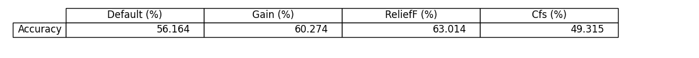

# ***Data-Mining-Cardiac-Arrhythmia***

 

## **◾ Introduction:**

*From the database about arrhythmias and the study on pre-processing, the repository aims to present and dicsuss the results obtained using the Decision Tree model J48.*

 

## **◾ Pre-processing:**

- *Describse the database attributes, numerical and categorical, classifying according to scale (nominal or ratio) and cardinality (discreet, continuous, binary).*
- *Describes each of the attributes according to frequency, minimum and maximum value, day standard deviations, as appropriate.*
- *After the classification process with J48 has been used, it also evaluates the results of the processes below:*  

  🔸   *Treat outliers and missing values*  
  🔸   *Normalization*  
  🔸   *Discretization*

 

## **◾ Results:**

*In order to compare the different outcomes, we built a accuracy x model table:*

 

 

## **◾ References:**  

## **[SciPy](https://docs.scipy.org/doc/scipy/)**

## **[Scikit-learn](https://scikit-learn.org/stable/)**

## **[Pandas](https://pandas.pydata.org/docs/)**
 
## **[Numpy](https://numpy.org/doc/)**

## **[Skfeature](https://jundongl.github.io/scikit-feature/html/skfeature.html)**

  
